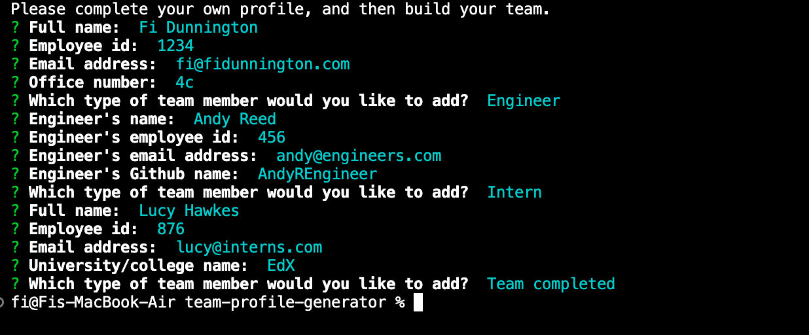
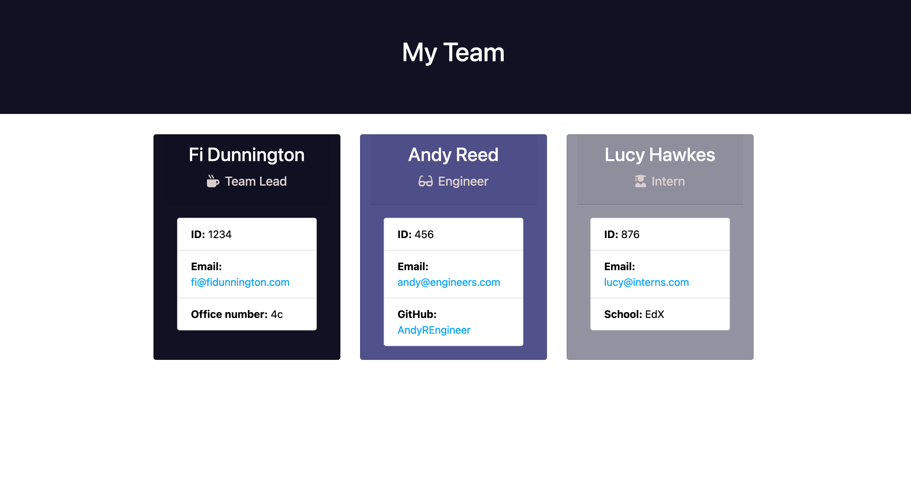

# team-profile-generator
  ----

  

  ## Description:

  ### Motivation
  The team-profile generator was a project built to demonstrate the use of Node.js to develop a command-line application that takes user-input data and    outputs an HTML file that can be viewed in the browser. The generator was also an exercise in OOP, where the .js code was written in order to pass the pre-determined Jest tests.

  ### Learnings
  Building the app was an exercies in careful structuring of .js code to ensure that the necessary data was extractable for the final HTML file. Whilst building child functions within a single parent function was the cleanest way to structure the code it means that the data of the different employee groups (manager/engineer/instern, in this example) isn't separable. I would like in the future to make the code more flexible by allowing these employee groups to be called spearately in the HTML. 

  ----

  ## Table of Contents:

  * [Installation](#installation)
  * [Application usage](#usage)
  * [License](#license)
  * [Contributing to the project](#contributing)
  * [How to test](#test)
  * [Questions](#questions)
  * [Credits](#credits)

  ----
  

  ## Installation:
  To use this app you will need to first install node and npm in your local dev environment. 

**Step 1:**
Install node.js (https://nodejs.dev/en/download/)

**Step 2:** 
Create and initialize a package.json file by running the following commands in the displayed order (inside the intended directory):

	$ npm init -y
	$ npm install

**Step 3:** 
Install npm's Inquirer module (read more about Inquirer here : https://www.npmjs.com/search?q=inquirer)

	$ npm install inquirer

**Step 4:**
Install npm's Jest module (read more about Jest here : https://www.npmjs.com/package/jest)

	$ npm install jest
  
**Step 5:**
Install npm's Path module (read more about Path here : https://www.npmjs.com/package/path)

	$ npm install path

  ## Usage
  Command-line inputs (driven by `inquire.prompt`) used to gather data
  
  
  
  
  Input data collated using JS functions, and outpute as an HTML file with the help of `nmp path` module.
  
  

  ## License
  This project uses the  license.

  ## Contributing
  
  
  We are happy for other developers to contribute to this project, and have adpoted the [Contributor Covenant](https://www.contributor-covenant.org/)

  ## Test
  To run the Jest tests run the following command from the app directory:
  ~~~
  npm test
  ~~~
  
  To test the app functionality run the following command from the app directory:
  ~~~
  node index.js
  ~~~

  ## Questions
  If you have any questions about the repo you can open an issue or contact me directly at fi.dunnington@gmail.com.

  You can find more of my work at [fdunnington](https://github.com/fdunnington).

  ## Credits
  - 
